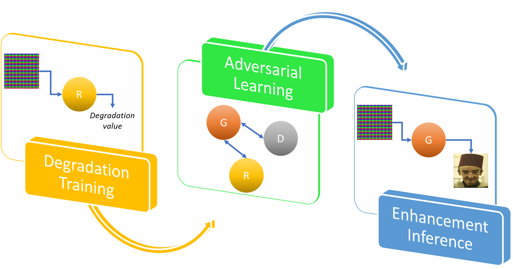
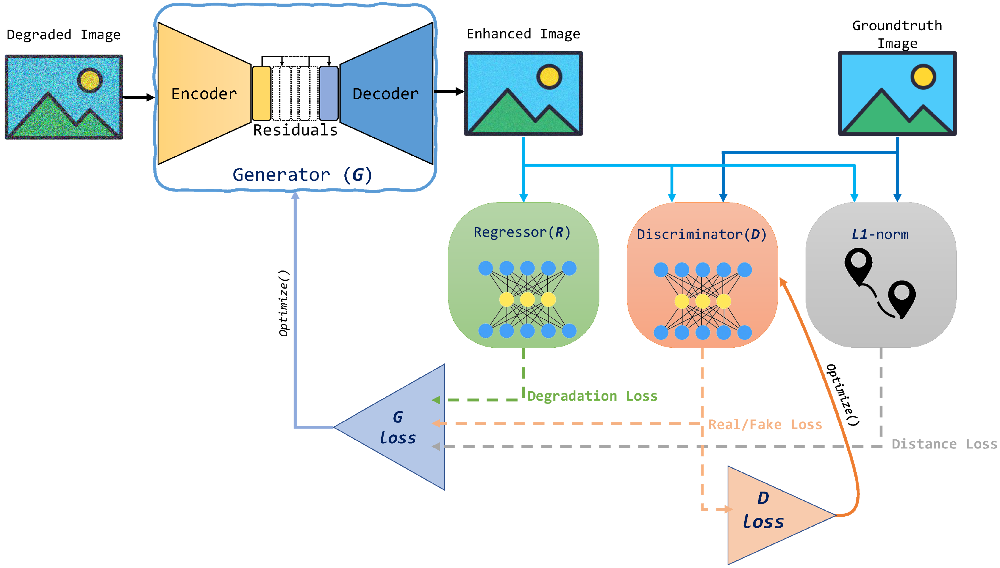

# DLL-GAN : Degradation-level-based learnable adversarial loss for image enhancement

Mohamed Kas. Abderrazak Chahi. Ibrahim Kajo. Yassine Ruichek

Submitted to Expert Systems With Applications

Paper link: 

## Highlights 
<ul>
  <li>	Proposal of a deep loss for image super resolution, denoising, JPEG artifacts removal </li>
  <li>	Extend the generative adversarial learning with a degradation estimation CNN network </li>
  <li>	Extensive ablation study on super resolution, denoising, JPEG artifacts applications </li>
  <li>	The DLL-GAN ensures good performance and robustness on high degradation levels </li>
</ul>

## Abstract 

Image enhancement has recently gained considerable attention owing to its benefits in cleaning input images before final processing and, thus, helping decision systems. The outstanding success of generative adversarial networks  has been exploited in image enhancement to handle various image generation challenges, and complex image enhancers incorporating new architectures and/or the use of metrics as loss functions have been proposed. However, degradation-aware loss functions that would help the generator deal with degradation have not been investigated. In this study, we propose a new adversarial learning paradigm, referred to as a degradation-level-based learnable generative adversarial network (DLL-GAN). In addition to the discriminator and L1 losses, a new loss is included in the DLL-GAN; it is calculated by using a convolutional-neural-network-based regressor that estimates the amount of degradation that is still present in the generator output and must be optimized during the learning process. The DLL-GAN is validated on three widely adopted and challenging image enhancement tasks: super-resolution, denoising, and JPEG artifact removal.  An extensive experimental analysis reveals that the DLL-GAN improves the baseline performance through significant gains, which are confirmed in visual results. The DLL-GAN outperforms the state-of-the-art methods in three applications, especially at high and challenging degradation levels.

## Framework 

<h1> Flowchart </h1>

<h1> Overall Architecture </h1>

